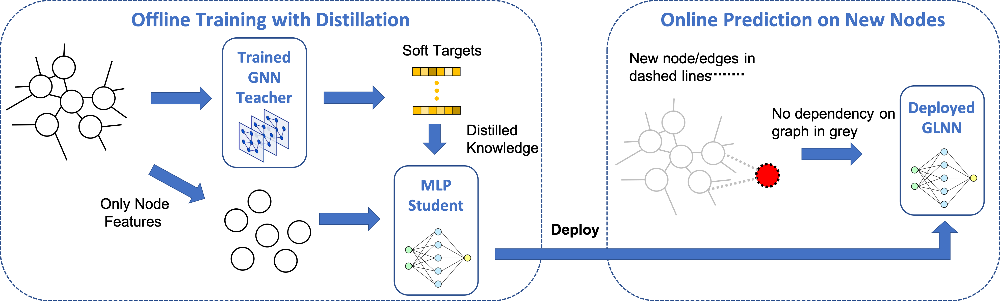
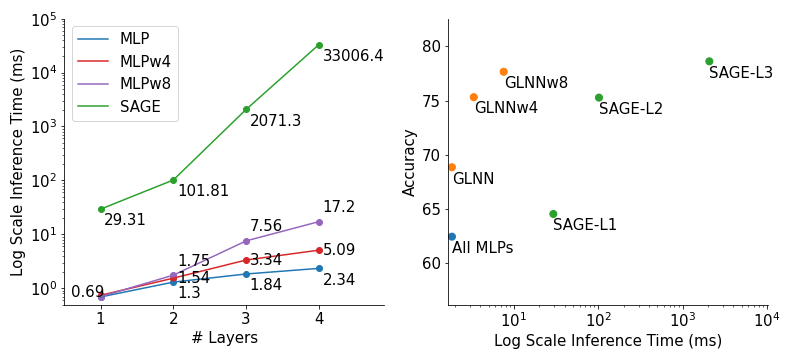

<!-- #region -->
# Graph-less Neural Network (GLNN)

Code for [Graph-less Neural Networks: Teaching Old MLPs New Tricks via Distillation](https://arxiv.org/pdf/2110.08727.pdf) by [Shichang Zhang](https://shichangzh.github.io/), [Yozen Liu](https://research.snap.com/team/yozen-liu/), [Yizhou Sun](http://web.cs.ucla.edu/~yzsun/), and [Neil Shah](http://nshah.net/).


## Overview
### Distillation framework
<p align="center">
  <br />
  
  <br />
</p>


### Accuracy vs. inference time on the `ogbn-products` dataset

<p align="center">
  <br />
  
  <br />
</p>


## Getting Started

### Requirements
- Install PyTorch following https://pytorch.org/
- Install DGL following https://www.dgl.ai/pages/start.html
- Our code has been tested with
    - Python = 3.6.9
    - PyTorch = 1.9.1
    - DGL = 0.6.1

Optional
- OGB version >= 1.2.6 for the OGB datasets
- Additional requirements in requirements.txt


### Dataset
To run experiments for dataset used in the paper, please download from the following links and put them under `data/` (some of them need to be renamed, see below).

- CPF_data (`cora`, `citeseer`, `pubmed`, `a-computer`, and `a-photo`): Download the '.npz' files from https://github.com/BUPT-GAMMA/CPF/tree/master/data/npz. Rename `amazon_electronics_computers.npz` and `amazon_electronics_photo.npz` to `a-computer.npz` and `a-photo.npz` respectively.

- OGB_data (`ogbn-arxiv` and `ogbn-products`): Datasets will be automatically downloaded when running the `load_data` function in `dataloader.py`. More details: https://ogb.stanford.edu/.

- BGNN_data (`house_class` and `vk_class`): Follow the instructions in https://github.com/dmlc/dgl/tree/473d5e0a4c4e4735f1c9dc9d783e0374328cca9a/examples/pytorch/bgnn and download dataset pre-processed in DGL format from https://www.dropbox.com/s/verx1evkykzli88/datasets.zip.

- NonHom_data (`penn94` and `pokec`): Follow the instructions in https://github.com/CUAI/Non-Homophily-Benchmarks to download the `penn94` dataset and its splits. The `pokec` dataset will be automatically downloaded when running the `load_data` function in `dataloader.py`.

- Your favourite datasets: download it add in it to the `load_data` function in `dataloader.py`.


### Usage
- To quickly train a teacher model you can run `train_teacher.py` by specifying the experiment setting, i.e. transductive (`tran`) or. inductive (`ind`), teacher model, e.g. `GCN`, and dataset, e.g. `cora`, like the example below.

```bash
python train_teacher.py --exp_setting tran --teacher GCN --dataset cora
```
- To quickly train a student model with a pretrained teacher you can run `train_student.py` by specifying the experiment setting, teacher model, student model, and dataset like the example below. Make sure you train the teacher using the `train_teacher.py` first and have its result stored in the correct path specified by `--out_t_path`.

```bash
python train_teacher.py --exp_setting ind --teacher SAGE --student MLP --dataset citeseer --out_t_path outputs
```
- For more examples and to reproduce results in the paper, please refer to scripts in `experiments/` like below.

```bash
sh experiments/sage_cpf.sh
```

- To extend GLNN to your own model, you may do one of the following.
    - Add your favourite model architectures to the `Model` class in `model.py`. Then follow the examples above.
    - Train teacher model and store its output (log probabilities). Then train the student by `train_student.py` with the correct `--out_t_path`.


## Results

GraphSAGE vs. MLP vs. GLNN under the production setting (transductive and inductive combined). $\Delta_{MLP}$ ($\Delta_{GNN})$ represents difference between the GLNN and the MLP (GNN). Results show classification accuracy (higher is better); $\Delta_{GNN}{\geq}0$ indicates \glnn{} outperforms GNN. We observe that GLNNs always improve from MLPs by large margins and achieve competitive results as GNN on 6/7 datasets. Please see Table 3 in the paper for more details.  

| Datasets   | GNN(SAGE)      | MLP          | GLNN           | $\Delta_{MLP}$  | $\Delta_{GNN}$    |
|------------|----------------|--------------|----------------|-----------------|-------------------|
| Cora       | **79.29**      | 58.98        | 78.28          | 19.30 (32.72\%) | -1.01 (-1.28\%)   |
| Citseer    | 68.38          | 59.81        | **69.27**      | 9.46 (15.82\%)  | 0.89 (1.30\%)     |
| Pubmed     | **74.88**      | 66.80        | 74.71          | 7.91 (11.83\%)  | -0.17 (-0.22\%)   |
| A-computer | 82.14          | 67.38        | **82.29**      | 14.90 (22.12\%) | 0.15 (0.19\%)     |
| A-photo    | 91.08          | 79.25        | **92.38**      | 13.13 (16.57\%) | 1.30 (1.42\%)     |
| Arxiv      | **70.73**      | 55.30        | 65.09          | 9.79 (17.70\%)  | -5.64 (-7.97\%)   |
| Products   | **76.60**      | 63.72        | 75.77          | 12.05 (18.91\%) | -0.83 (-1.09\%)   |

<!-- 
| Datasets   | Eval | SAGE           | MLP/MLP+     | GLNN/GLNN+     | $\Delta_{MLP}$  | $\Delta_{GNN}$    |
|------------|------|----------------|--------------|----------------|-----------------|-------------------|
| Cora       | prod | **79.29**      | 58.98        | 78.28          | 19.30 (32.72\%) | -1.01 (-1.28\%)   |
|            | ind  | 81.33 ± 2.19   | 59.09 ± 2.96 | 73.82 ± 1.93   | 14.73 (24.93\%) | -7.51 (-9.23\%)   |
|            | tran | 78.78 ± 1.92   | 58.95 ± 1.66 | 79.39 ± 1.64   | 20.44 (34.66\%) | 0.61 (0.77\%)     |
| Citseer    | prod | 68.38          | 59.81        | **69.27**      | 9.46 (15.82\%)  | 0.89 (1.30\%)     |
|            | ind  | 69.75 ± 3.59   | 60.06 ± 5.00 | 69.25 ± 2.25   | 9.19 (15.30\%)  | -0.5 (-0.7\%)     |
|            | tran | 68.04 ± 3.34   | 59.75 ± 2.48 | 69.28 ± 3.12   | 9.63 (15.93\%)  | 1.24 (1.82\%)     |
| Pubmed     | prod | **74.88**      | 66.80        | 74.71          | 7.91 (11.83\%)  | -0.17 (-0.22\%)   |
|            | ind  | 75.26 ± 2.57   | 66.85 ± 2.96 | 74.30 ± 2.61   | 7.45 (11.83\%)  | -0.96 (-1.27\%)   |
|            | tran | 74.78 ± 2.22   | 66.79 ± 2.90 | 74.81 ± 2.39   | 8.02 (12.01\%)  | 0.03 (0.04\%)     |
| A-computer | prod | 82.14          | 67.38        | **82.29**      | 14.90 (22.12\%) | 0.15 (0.19\%)     |
|            | ind  | 82.08 ± 1.79   | 67.84 ± 1.78 | 80.92 ± 1.36   | 13.08 (19.28\%) | -1.16 (-1.41\%)   |
|            | tran | 82.15 ± 1.55   | 67.27 ± 1.36 | 82.63 ± 1.40   | 15.36 (22.79\%) | 0.48 (0.58\%)     |
| A-photo    | prod | 91.08          | 79.25        | **92.38**      | 13.13 (16.57\%) | 1.30 (1.42\%)     |
|            | ind  | 91.50 ± 0.79   | 79.44 ± 1.72 | 91.18 ± 0.81   | 11.74 (14.78\%) | -0.32 (-0.35\%)   |
|            | tran | 90.80 ± 0.77   | 79.20 ± 1.64 | 92.68 ± 0.56   | 13.48 (17.01\%) | 1.70 (1.87\%)     |
| Arxiv      | prod | **70.73**      | 55.30        | 65.09          | 9.79 (17.70\%)  | -5.64 (-7.97\%)   |
|            | ind  | 70.64 ± 0.67   | 55.40 ± 0.56 | 60.48 ± 0.46   | 4.3 (7.76\%)    | -10.94 (-15.49\%) |
|            | tran | 70.75 ± 0.27   | 55.28 ± 0.49 | 71.46 ± 0.33   | 11.16 (20.18\%) | -4.31 (-6.09\%)   |
| Products   | prod | **76.60**      | 63.72        | 75.77          | 12.05 (18.91\%) | -0.83 (-1.09\%)   |
|            | ind  | 76.89 ± 0.53   | 63.70 ± 0.66 | 75.16 ± 0.34   | 11.44 (17.96\%) | -1.73 (-2.25\%)   |
|            | tran | 76.53 ±0.55    | 63.73 ± 0.69 | 75.92 ± 0.61   | 12.20 (19.15\%) | -0.61 (-0.79\%)   |
 -->

## Cite

Please cite our paper if you use this code in your own work:

```
@misc{zhang2021graphless,
      title={Graph-less Neural Networks: Teaching Old MLPs New Tricks via Distillation}, 
      author={Shichang Zhang and Yozen Liu and Yizhou Sun and Neil Shah},
      year={2021},
      eprint={2110.08727},
      archivePrefix={arXiv},
      primaryClass={cs.LG}
}
```

## Contact Us

Please open an issue or contact shichang@cs.ucla.edu if you have any questions.
<!-- #endregion -->
